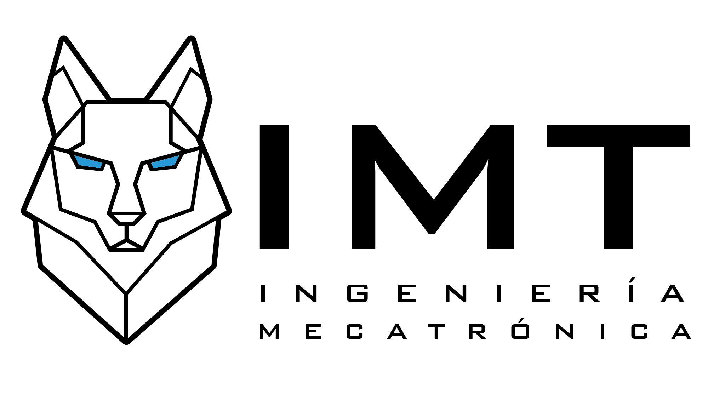
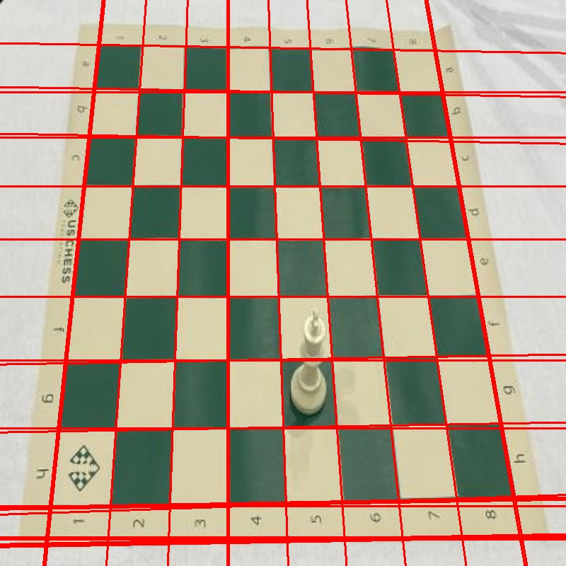
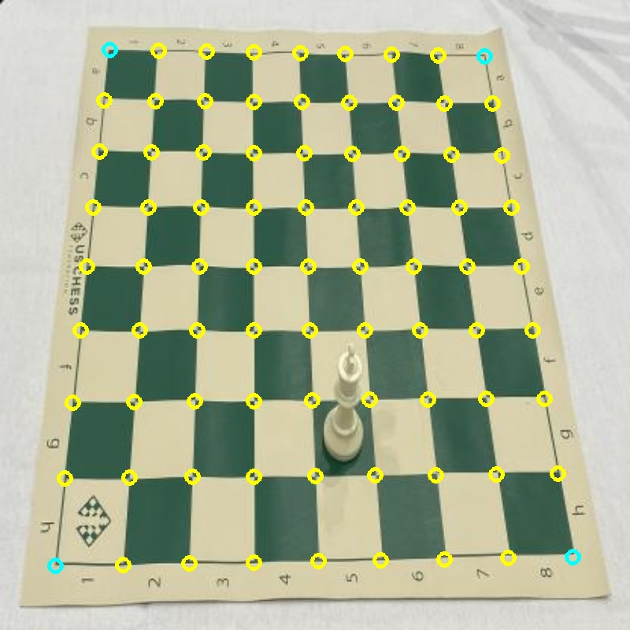
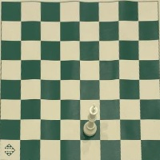
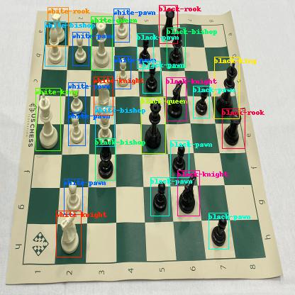

  

# Final Project Artificial Vision

Chess is a game played by amateurs all over the world. In this way certain opening movements and checkmates were developed in order to improve the way players start a game. Traditional practice don’t give an instant feedback of the movements. In this way, the virtualization of the chessboard can help players to improve since openings and plays specify the movement of the pieces and the player can memorize them by getting feedback of their movements.

  <a href="#Pipeline"><b>Pipeline</b></a> |
  <a href="#Results"><b>Results</b></a> |
  <a href="#How to run"><b>How to run</b></a> |

## Pipeline
The following pipeline was presented for recognizing the chess board:
Converting the image to gray-scale.
1. Blurring the image.
2. Getting edges by Canny.
3. Using Hough Lines to determine the principal lines of the board.

  

5. Getting the intersection points of the found lines to get the corners of the board.
6. Clustering of the nearby points in the intersections.
7. Getting the outer corners.

  

9. Using homography to present the perpendicular vision of the warped board.

  

On the other hand, once recognized the board, the next step is recognizing the pieces. We used Yolov4 because of its accuracy and fast response. We've trained our model on Google Collaboratory with the following dataset: https://public.roboflow.com/object-detection/chess-full available at Roboflow and updated on February 2021. Our best model was trained with 78 epochs and a batch size of 2 and can be downloaded in https://drive.google.com/file/d/1ms2k8fF99hvYL7YZQL3XTeQ0N7-QdrD0/view?usp=sharing .

  

Finally, we 

## Results

## How to run

  

about
